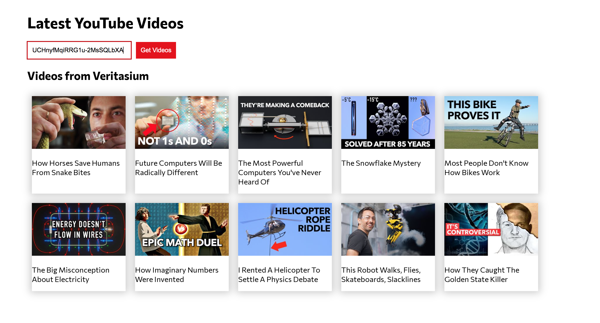

# Youtube viewer app

### Overview
YouTube channel viewing app. Enter a YouTube channel ID to the search bar and the channel's 10 most recent videos will display. A YouTube channel ID can be found following the 'https://www.youtube.com/channel/' in the URL when visiting a channel's home page. Project inspired by [this tutorial](https://www.youtube.com/watch?v=X6GpRxu4q_s).

### Learning Objectives
Improve knowledge surrounding asynchronous request, error catching. Styling using Sass preprocessing language for CSS.

